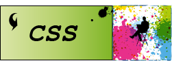
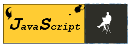

<h1 align="center">Portfolio / Портфолио</h1>

  
 
 
 

## Description

**This is project my site portfolio**
**Этот скромный проект моего портфолио**

<h3 align="center">Дизайн</h3>
Дизайн разрабатыался мной.Точнее придумывался на лету. Хотя я конечно же не дизайнер.

 
 

**Проект размещён на github pages Go check ---> в разработке 

## Стек проекта

- [***Bootstrap 5***](https://getbootstrap.com/ "Bootstrap 5 home") CSS-фреймворк с открытым исходным кодом, предназначенный для адаптивной, ориентированной на мобильные устройства фронтальной веб-разработки.
- [***html***](https://html.spec.whatwg.org/multipage/ "html specification") (HyperText Markup Language — «язык гипертекстовой разметки») — самый базовый строительный блок Веба. Он определяет содержание и структуру веб-контента.
- [***Css***](https://www.w3.org/Style/CSS/specs.en.html "Css specification") Формальный язык декорирования и описания внешнего вида документа (веб-страницы), написанного с использованием языка разметки.
- [***Sass(Scss)***](https://sasscss.org/documentation "Sass documentanion") Препроцессор, который служит для быстрого написания CSS стилей.
- [***jquery***](https://jquery.com/ "jquery home")   jQuery помогает легко получать доступ к любому элементу DOM, обращаться к атрибутам и содержимому элементов DOM, манипулировать ими. Также библиотека jQuery предоставляет удобный API для работы с AJAX.

### Так-же планирую установить данную верстку на Wordpress и все последующие проекты

 Проект, так-же как и последующие в портфолио относится к демонстационным для потенцеальных работодателей. 

<h2 align="center">Обращение к потенциальным работодателям</h2>

Сайт портфолио будет размещён на хостинге и добавлен функционал комментариев по моим работам.

Не поскупитесь на отзывы комментарии и замечания по моим работам. Я стараюсь прилагать все возможные усилия стобы соответствовать требованиям работодателей для позиции front-end разработчика или верстальщика. Ваши комментарии помогут мне скорректировать путь обучения и развития

Так-же с удовольствием приму предложения по трудоустройству на позиции front-end разработчик, верстальщик,full-stack разработчик, react-разработчик.

## Контакты / Contacts

#### Country: Russia
#### City: Sant-Petersberg
#### email: baleksandr012@yandex.ru
#### tel: +7(981)173-38-24

